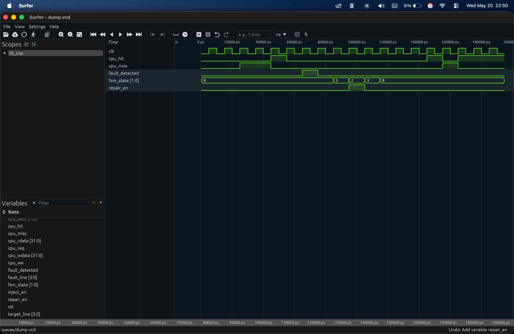

# 🧠 Self-Healing Cache Controller with Fault Injection & Recovery FSM

A fault-tolerant RTL cache controller capable of detecting simulated hardware faults and autonomously recovering using a dedicated Recovery Finite State Machine (FSM).

## ✨ Features

- Direct-mapped cache controller
- Fault injection module
- Recovery FSM
- Autonomous cache-line invalidation
- GTKWave waveform visualization
- Modular Verilog RTL design

---

## 🏗 Architecture

```text
CPU → Cache Controller → Fault Detection → Recovery FSM → Self-Healing
```

---

## 📂 Project Structure

```text
self_healing_cache/
├── rtl/
│   ├── cache_controller.v
│   ├── parity_checker.v
│   ├── fault_injector.v
│   └── recovery_fsm.v
├── tb/
│   └── tb_top.v
├── sim/
│   └── run.sh
└── README.md
```

---

## ▶️ Running the Simulation

```bash
chmod +x sim/run.sh
./sim/run.sh
```

Open waveforms:

```bash
gtkwave waves/dump.vcd
```

---

## 🔍 Recovery FSM Flow

```text
IDLE → DETECT → REPAIR → RESUME → IDLE
```

---
## 📸 Waveform Output



---

## 📈 Concepts Demonstrated

- Cache architecture
- FSM design
- Fault tolerance
- Hardware verification
- RTL simulation
- Waveform debugging

---

## 🚀 Future Improvements

- ECC / Hamming code
- 2-way set associative cache
- LRU replacement policy
- Fault logging registers
- SystemVerilog assertions

---

## 👨‍💻 Author

B Prince Philomon
